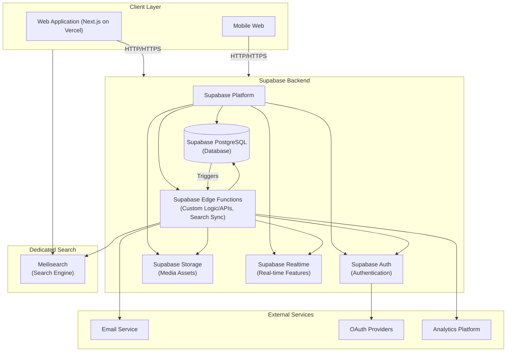
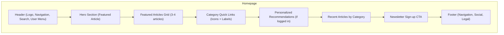
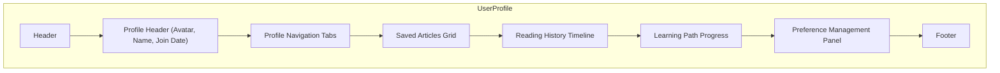
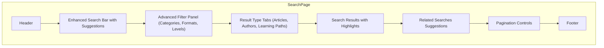

# TechNexus Blog System Design

This document details the system architecture, data structures, API design, and key technical decisions for the TechNexus Blog platform.

## 1. Implementation Approach

Based on the PRD requirements, we'll design a robust, scalable, and maintainable system for the TechNexus Blog. The implementation will focus on:

### 1.1 Key Technical Decisions

1. **API-First Architecture**: We'll use a headless CMS approach with API-driven frontend to provide maximum flexibility and support all required content formats.
2. **Microservices Architecture**: Separate services for content management, user authentication, search, and analytics will allow for independent scaling and easier maintenance.
3. **Frontend Stack**:
    - React.js with Next.js for server-side rendering
    - Tailwind CSS for styling (aligns with the design system requirements)
    - TypeScript for type safety and better developer experience
4. **Backend Stack**:
    - **Supabase**: A Backend-as-a-Service (BaaS) platform providing:
        - PostgreSQL for content storage (relational database for structured content schema)
        - Built-in Authentication for user management
        - Storage for media assets
        - Realtime for real-time features
        - Edge Functions for custom backend logic
5. **Authentication & Authorization**:
    - **Supabase Auth**: Handles user authentication (email/password, OAuth) and JWT generation.
    - OAuth integration for social logins (Google, GitHub, Instagram, Facebook, X, LinkedIn)
    - Role-based access control (managed via Supabase Row Level Security and custom policies)
6. **Search & Discovery**:
    - **Meilisearch**: A dedicated, fast search engine for advanced content search and discovery.
    - AI-powered recommendation engine (future integration)
7. **Media Management**:
    - **Supabase Storage** for media asset storage.
    - **Vercel Edge Network** for global asset delivery (for frontend assets).
    - Image optimization pipeline
8. **Deployment & DevOps**:
    - **Cloud Provider**: **AWS** (underlying infrastructure for Vercel and Supabase).
    - **Frontend Hosting & CDN**: Vercel (Edge Network)
    - **Backend-as-a-Service (BaaS)**: Supabase (PostgreSQL, Auth, Storage, Edge Functions)
    - **Search Engine**: Meilisearch
    - **Caching/In-memory Store**: Redis
    - **Object Storage**: Supabase Storage
    - CI/CD pipeline for automated testing and deployment (Vercel for frontend, GitHub Actions/similar for Supabase Edge Functions).

### 1.2 Open Source Libraries & Frameworks

1. **Frontend**:
    - Next.js: For server-side rendering and optimal SEO
    - React Query: For data fetching and caching
    - Monaco Editor: For interactive code playgrounds
    - Chart.js: For data visualization
    - Framer Motion: For animations and micro-interactions
2. **Backend**:
    - No specific backend frameworks are used directly, as Supabase provides managed services and Edge Functions for custom logic.
    - Prisma: ORM for database interactions (implicitly used with Supabase PostgreSQL)
    - GraphQL Yoga/Apollo Client: For GraphQL integration on the frontend (if applicable)
3. **Testing & Quality**:
    - Jest: Unit and integration testing
    - Cypress: End-to-end testing
    - Lighthouse CI: Performance and accessibility monitoring

### 1.3 Difficult Points & Solutions

1. **Content Personalization**:
    - Challenge: Delivering personalized content while maintaining performance
    - Solution: Edge-based personalization with user preference caching
2. **Interactive Content**:
    - Challenge: Supporting various interactive content types securely
    - Solution: Sandboxed execution environments for code playgrounds
3. **Performance with Rich Content**:
    - Challenge: Maintaining fast load times with media-rich articles
    - Solution: Aggressive image optimization, lazy loading, and content chunking
4. **Multi-audience Content**:
    - Challenge: Serving different audience segments with appropriate content
    - Solution: Content tagging system with audience targeting capabilities
5. **Search Relevance**:
    - Challenge: Delivering highly relevant search results across technical topics
    - Solution: Domain-specific query enhancement and faceted search

## 2. Data Structures and Interfaces

The core data structures are defined in the class diagram, with relationships between entities like User, Article, Category, and interactive components.

## 3. System Architecture Diagram



## 4. Database Schema Design

The PostgreSQL schema design follows a relational model that supports the content types and relationships defined in the class diagram:

### 4.1 Users Table

```javascript
{
  id: UUID,
  username: String,
  email: String,
  passwordHash: String, // Or managed by Supabase Auth
  firstName: String,
  lastName: String,
  role: String, // READER, CONTRIBUTOR, EDITOR, ADMIN
  createdAt: Date,
  updatedAt: Date,
  preferences: {
    favoriteCategories: [UUID], // Category IDs
    savedArticles: [UUID], // Article IDs
    followedAuthors: [UUID], // Author IDs
    preferredLevel: String, // BEGINNER, INTERMEDIATE, ADVANCED
    darkModeEnabled: Boolean,
    emailNotificationsEnabled: Boolean,
    preferredFormats: [String] // ARTICLE, TUTORIAL, etc.
  }
}
```

### 4.2 Authors Table

```javascript
{
  id: UUID,
  userId: UUID, // Reference to Users table
  bio: String,
  expertise: String,
  specializations: [String],
  avatarUrl: String,
  socialLinks: [
    { platform: String, url: String }
  ],
  joinedDate: Date
}
```

### 4.3 Articles Table

```javascript
{
  id: UUID,
  title: String,
  slug: String,
  excerpt: String,
  content: [
    {
      type: String, // text, image, code, video, interactive
      content: String,
      metadata: Object // Specific to content type
    }
  ],
  authorId: UUID, // Reference to Authors table
  primaryCategoryId: UUID, // Reference to Categories table
  secondaryCategories: [UUID], // References to Categories table
  tags: [String],
  expertiseLevel: String, // BEGINNER, INTERMEDIATE, ADVANCED
  format: String, // ARTICLE, TUTORIAL, CASE_STUDY, etc.
  publishedDate: Date,
  updatedDate: Date,
  readTimeMinutes: Number,
  meta: {
    title: String,
    description: String,
    keywords: [String],
    ogImage: String
  },
  statistics: {
    views: Number,
    uniqueVisitors: Number,
    likes: Number,
    shares: Number,
    bookmarks: Number,
    commentCount: Number,
    averageTimeOnPage: Number,
    scrollDepthPercentage: Number
  },
  isTopPick: Boolean, // Added for "Top Picks" section
  topPickOrder: Number, // Added for explicit ordering of "Top Picks"
  status: String // DRAFT, REVIEW, PUBLISHED, ARCHIVED
  // Frontend Rendering Note: Each 'type' in the content array will map to a dedicated React component
  // responsible for rendering that specific block (e.g., <TextBlock />, <CodeBlock />, <ImageBlock />, <InteractivePlayground />).
 }
```

### 4.4 Categories Table

```javascript
{
  id: UUID,
  name: String,
  slug: String,
  description: String,
  iconUrl: String,
  parentCategoryId: UUID, // Reference to Categories table for hierarchy
  order: Number, // For custom sorting
  isActive: Boolean
}
```

### 4.5 Comments Table

```javascript
{
  id: UUID,
  articleId: UUID, // Reference to Articles table
  userId: UUID, // Reference to Users table
  content: String,
  parentCommentId: UUID, // For threaded comments
  createdAt: Date,
  isApproved: Boolean,
  upvotes: Number,
  downvotes: Number,
  reports: Number // For moderation
}
```

### 4.6 LearningPaths Table

```javascript
{
  id: UUID,
  title: String,
  slug: String,
  description: String,
  startLevel: String, // BEGINNER, INTERMEDIATE, ADVANCED
  endLevel: String, // BEGINNER, INTERMEDIATE, ADVANCED
  articles: [
    { articleId: UUID, order: Number, isRequired: Boolean }
  ],
  estimatedHours: Number,
  createdBy: UUID, // Reference to Users table
  createdAt: Date,
  updatedAt: Date,
  isActive: Boolean
}
```

### 4.7 Newsletters Table

```javascript
{
  id: UUID,
  name: String,
  description: String,
  categories: [UUID], // References to Categories table
  level: String, // BEGINNER, INTERMEDIATE, ADVANCED
  subscriberCount: Number,
  lastSentDate: Date,
  createdAt: Date,
  updatedAt: Date
}
```

## 5. API Endpoints

The API design follows RESTful principles with GraphQL support for complex queries.

## 5.1 REST API Endpoints

### 5.1.1 Authentication

- `POST /api/auth/register` - Register a new user
- `POST /api/auth/login` - Login and receive JWT token
- `POST /api/auth/logout` - Logout and invalidate token
- `GET /api/auth/me` - Get current user information
- `POST /api/auth/refresh-token` - Refresh JWT token
- `POST /api/auth/forgot-password` - Send password reset email
- `POST /api/auth/reset-password` - Reset password with token
- `POST /api/auth/oauth/:provider` - OAuth authentication (Supported providers: Google, GitHub, Instagram, Facebook, X, LinkedIn)

### 5.1.2 Users & Authors

- `GET /api/users/:id` - Get user profile
- `PUT /api/users/:id` - Update user profile
- `GET /api/users/:id/preferences` - Get user preferences
- `PUT /api/users/:id/preferences` - Update user preferences
- `GET /api/authors/:id` - Get author profile
- `GET /api/authors/:id/articles` - Get author's articles
- `POST /api/authors` - Create author profile (for contributors)
- `PUT /api/authors/:id` - Update author profile

### 5.1.3 Articles & Content

- `GET /api/articles` - List articles with filters
- `GET /api/articles/featured` - Get featured articles
- `GET /api/articles/:slug` - Get article by slug +- GET /api/articles/top-picks - Get curated "Top Picks" articles (potentially with ordering)
- `GET /api/articles/top-picks` - Get curated "Top Picks" articles (potentially with ordering)
- `POST /api/articles` - Create new article (authenticated)
- `PUT /api/articles/:id` - Update article
- `DELETE /api/articles/:id` - Delete article
- `GET /api/articles/:id/related` - Get related articles
- `GET /api/articles/:id/comments` - Get article comments
- `POST /api/articles/:id/comments` - Add comment to article
- `POST /api/articles/:id/like` - Like an article
- `POST /api/articles/:id/save` - Save article to reading list
- `POST /api/articles/:id/view` - Record article view

### 5.1.4 Categories & Tags

- `GET /api/categories` - List all categories
- `GET /api/categories/:slug` - Get category by slug
- `GET /api/categories/:slug/articles` - Get articles in category
- `GET /api/tags` - List all tags
- `GET /api/tags/:slug/articles` - Get articles with tag

### 5.1.5 Search

- `GET /api/search` - Search articles with filters
- `GET /api/search/suggestions` - Get search suggestions

### 5.1.6 Interactive Content

- `GET /api/code-playgrounds/:id` - Get code playground data
- `POST /api/code-playgrounds/:id/execute` - Execute code
- `POST /api/code-playgrounds/:id/save` - Save code playground state
- `GET /api/interactive/:id` - Get interactive element data
- `POST /api/interactive/:id/state` - Update interactive state

### 5.1.7 Learning

- `GET /api/learning-paths` - List learning paths
- `GET /api/learning-paths/:slug` - Get learning path
- `POST /api/learning-paths/:id/enroll` - Enroll in learning path
- `GET /api/learning-paths/:id/progress` - Get user progress
- `POST /api/learning-paths/:id/progress` - Update user progress

### 5.1.8 Newsletters

- `GET /api/newsletters` - List available newsletters
- `POST /api/newsletters/subscribe` - Subscribe to newsletter
- `DELETE /api/newsletters/unsubscribe` - Unsubscribe from newsletter

### 5.1.9 Admin

- `GET /api/admin/dashboard` - Get admin dashboard metrics
- `GET /api/admin/users` - Manage users
- `GET /api/admin/content` - Manage content
- `GET /api/admin/comments` - Moderate comments

Note: API endpoints for the homepage content blocks (Hero, Featured, Category Showcases, Popular, Top Picks) will need to be optimized for efficient data retrieval and aggregation.

_Implementation Note: API development will be phased. Initial phases will focus on core authentication, user management, and content retrieval (articles, categories). Subsequent phases will build out APIs for interactive features, learning paths, and advanced personalization._

## 5.2 GraphQL Schema (Key Parts)

```graphql
type Query {
  # Articles
  articles(filters: ArticleFilters): ArticlePagination
  article(slug: String!): Article
  topPicksArticles: [Article!] # Added for Top Picks
  featuredArticles: [Article!]

  # Categories
  categories: [Category!]
  category(slug: String!): Category

  # Users & Authors
  me: User
  author(id: ID!): Author

  # Search
  search(query: String!, filters: SearchFilters): SearchResults

  # Recommendations
  recommendedArticles: [Article!]
  similarArticles(articleId: ID!): [Article!]
  personalizedFeed: [Article!]
}

type Mutation {
  # Authentication
  login(email: String!, password: String!): AuthPayload
  register(input: RegisterInput!): AuthPayload

  # User actions
  updateUserProfile(input: ProfileInput!): User
  updateUserPreferences(input: PreferencesInput!): User

  # Content interactions
  createComment(articleId: ID!, content: String!): Comment
  likeArticle(articleId: ID!): Boolean
  saveArticle(articleId: ID!): Boolean

  # Content creation (authenticated)
  createArticle(input: ArticleInput!): Article
  updateArticle(id: ID!, input: ArticleInput!): Article
}

# Key types (simplified)
type Article {
  id: ID!
  title: String!
  slug: String!
  excerpt: String
  content: [ContentBlock!]!
  author: Author!
  primaryCategory: Category!
  secondaryCategories: [Category!]
  tags: [String!]
  expertiseLevel: ExpertiseLevel!
  format: ContentFormat!
  publishedDate: DateTime
  updatedDate: DateTime
  readTimeMinutes: Int
  statistics: ArticleStatistics
  comments: [Comment!]
  isTopPick: Boolean # Added for Top Picks
  topPickOrder: Int # Added for Top Picks ordering
  isFeatured: Boolean
}

type ContentBlock {
  id: ID!
  type: String!
  content: String!
  metadata: JSONObject
}

type Category {
  id: ID!
  name: String!
  slug: String!
  description: String
  iconUrl: String
  parentCategory: Category
  subCategories: [Category!]
  articles: [Article!]
}

type User {
  id: ID!
  username: String!
  email: String!
  firstName: String
  lastName: String
  role: UserRole!
  preferences: UserPreferences
  savedArticles: [Article!]
}

type Author {
  id: ID!
  user: User!
  bio: String
  expertise: String
  specializations: [String!]
  avatarUrl: String
  socialLinks: [SocialLink!]
  articles: [Article!]
}
```

## 6. Backend as a Service (BaaS) Evaluation

The backend is primarily built on **Supabase**, a Backend-as-a-Service (BaaS) platform, for rapid development and simplified management of foundational features. This aligns with a microservice-oriented approach by providing distinct, managed services for common backend needs.

## 7. Frontend Wireframes & Design

### 7.1 Brand Elements

#### 7.1.1 Color Palette

As specified in the PRD:

- **Primary Colors**:

  - Primary Blue: #2563EB
  - Secondary Teal: #0D9488
  - Accent Orange: #F97316

- **Neutral Colors**:

  - Dark: #1E293B
  - Medium: #64748B
  - Light: #F1F5F9
  - White: #FFFFFF

- **Semantic Colors**:
  - Success: #10B981
  - Warning: #F59E0B
  - Error: #EF4444
  - Info: #3B82F6

#### 7.1.2 Typography

- **Primary Font**: Inter (Sans-serif)

  - Headings, UI elements, body text
  - Weights: 400 (regular), 500 (medium), 600 (semibold), 700 (bold)

- **Monospace Font**: JetBrains Mono

  - Code blocks, technical specifications
  - Weights: 400 (regular), 700 (bold)

- **Font Sizing**:
  - Base size: 16px
  - Scale: 1.250 (major third) typographic scale

### 7.2 Wireframes

The following provides wireframe descriptions for key pages of the TechNexus Blog:

#### 7.2.1 Homepage Wireframe



The homepage features a clean, modern design with a hero section showcasing a featured article, followed by a grid of featured content. Category quick links provide easy navigation to main topics. For logged-in users, a personalized section displays recommended content based on preferences and reading history.

#### 7.2.2 Category Page Wireframe

```mermaid
graph TD
    subgraph CategoryPage
        Header-->CategoryHeader
        CategoryHeader["Category Header (Name, Description, Icon)"]-->FilterSection
        FilterSection["Filter Bar (Expertise Level, Content Format, Date)"]-->FeaturedCategoryContent
        FeaturedCategoryContent["Featured Category Content"]-->SubcategoryNav
        SubcategoryNav["Subcategory Navigation Tabs"]-->ArticleGrid
        ArticleGrid["Article Grid with Format Icons"]-->RelatedCategories
        RelatedCategories["Related Categories Section"]-->PaginationControls
        PaginationControls["Pagination Controls"]-->Footer
    end
```



Category pages start with a distinctive header that includes the category icon and description. A filter bar allows users to refine content by expertise level, format, and date. Featured content for the category is prominently displayed, followed by subcategory navigation tabs and a grid of articles with visual indicators for content formats.

#### 7.2.3 Article Page Wireframe

```mermaid
graph TD
    subgraph ArticlePage
        Header-->ArticleHeader
        ArticleHeader["Article Header (Title, Author, Date, Reading Time)"]-->MetaInfo
        MetaInfo["Meta Information (Expertise Level, Category, Format)"]-->TOC
        TOC["Table of Contents (for longer articles)"]-->ArticleContent
        ArticleContent["Article Content (Text, Images, Code Blocks, Interactive Elements)"]-->AuthorBio
        AuthorBio["Author Bio Section"]-->CTASection
        CTASection["Call-to-Action Section (Related Learning Path)"]-->RelatedArticles
        RelatedArticles["Related Articles Grid"]-->CommentSection
        CommentSection["Comment Section (Threaded comments)"]-->Footer
    end
```



Article pages prioritize readability with a clean layout and typography optimized for long-form content. The header includes essential metadata like reading time and expertise level. For technical articles, code blocks use syntax highlighting and copy functionality. Interactive elements are clearly delineated from static content. The right sidebar (on desktop) includes a sticky table of contents for easy navigation of longer articles.

#### 7.2.4 User Profile Wireframe



The user profile includes sections for saved articles, reading history, and learning path progress. A preference management panel allows users to customize their content experience by selecting preferred categories, formats, and expertise levels.

#### 7.2.5 Search Results Wireframe



The search page features an enhanced search bar with auto-suggestions as users type. Results are organized by type (articles, authors, learning paths) with relevant sections highlighted. An advanced filter panel allows users to refine results by multiple criteria.

## 8. Program Call Flow

The sequence diagram illustrates key user flows including authentication, content browsing, article reading, commenting, and interactive content engagement.

## 9. Anything UNCLEAR

1. **Content Approval Workflow**: The PRD mentions editorial workflows but doesn't specify if all content requires approval or if certain trusted contributors can publish directly. We've designed for a flexible workflow that can accommodate both approaches.

2. **Monetization Strategy**: While mentioned as an open question in the PRD, no specific monetization requirements were provided. The system architecture supports future implementation of premium content, subscriptions, or other monetization models.

3. **Mobile App Requirements**: The PRD mentions mobile experience but doesn't specify if a dedicated mobile app is needed in addition to the responsive web experience. We've designed for progressive web app functionality that provides app-like features in the browser.

4. **AI Content Generation**: The PRD mentions AI-assisted content as an open question. The architecture supports integration with AI services, but specific implementation would depend on defined guidelines.

5. **Traffic Volume Expectations**: Specific performance requirements like concurrent users and traffic volume weren't specified. The architecture is designed to be horizontally scalable to accommodate growth.
